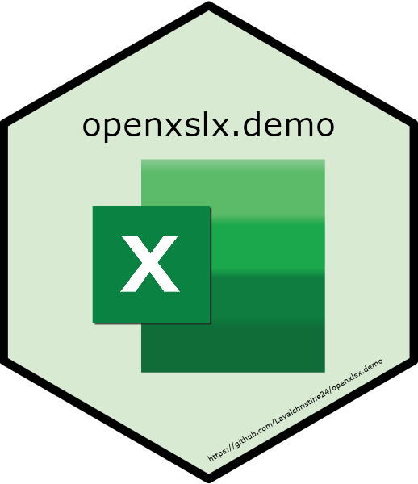

<!-- README.md is generated from README.Rmd. Please edit that file -->

# openxlsx.demo 

<!-- badges: start -->
<!-- badges: end -->

The goal of `openxlsx.demo` is to create an excel file from scratch only
using `openxlsx` and adding some features one could be interested in.

You can find an explanation about how the `openxlsx` functions are used
in the `openxlsx.demo` package in my blog post
[`Working with {openxlsx}`](https://layalchristinelettry.rbind.io/blog/202303_openxlsx/).

## `openxlsx` Documentation

You can find a description of the `openxlsx` functions by clicking on
the following links:

- [Homepage](https://ycphs.github.io/openxlsx/index.html)

- [GitHub](https://github.com/ycphs/openxlsx)

- [CRAN](https://cran.r-project.org/web/packages/openxlsx/openxlsx.pdf)

- [RDocumentation](https://www.rdocumentation.org/packages/openxlsx/versions/4.2.5.2)

## Installation

You can install the development version of openxlsx.demo like so:

``` r
# install.packages("devtools")
devtools::install_github("Layalchristine24/openxlsx.demo")
```

## Example

This is a basic example which shows you how to create the demo xlsx
file.

``` r
library(openxlsx.demo)

data_penguins <- palmerpenguins::penguins
data_penguins_raw <- palmerpenguins::penguins_raw
folder_xlsx_file <- tempdir()

write_penguins(
  data_penguins = data_penguins,
  data_penguins_raw = data_penguins_raw,
  folder_xlsx_file = folder_xlsx_file
)

browseURL(folder_xlsx_file)
```
